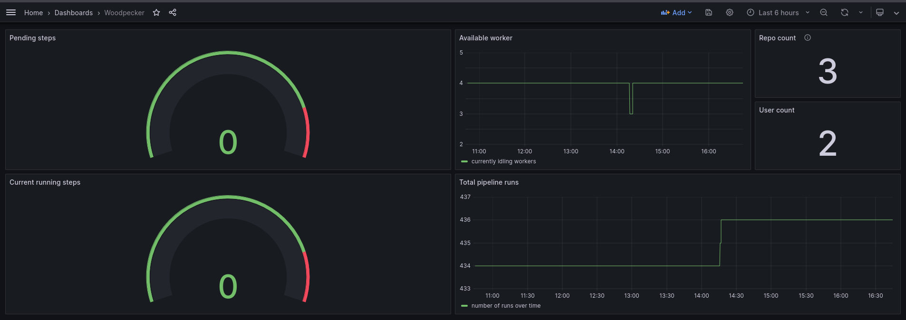

# Woodpecker Grafana Dashboard

This is a very basic dashboard using the data woodpecker provides on the `/metrics` endpoint which is documented on the Woodpecker [Prometheus](https://woodpecker-ci.org/docs/administration/prometheus) page.
Consult the [Grafana documentation](https://grafana.com/docs/grafana/latest/dashboards/manage-dashboards/#import-a-dashboard) for instructions on how to import a dashboard.
The content of this repository is distributed under the Apache 2.0 License, which is the same license [Woodpecker](https://woodpecker-ci.org/) is using.

